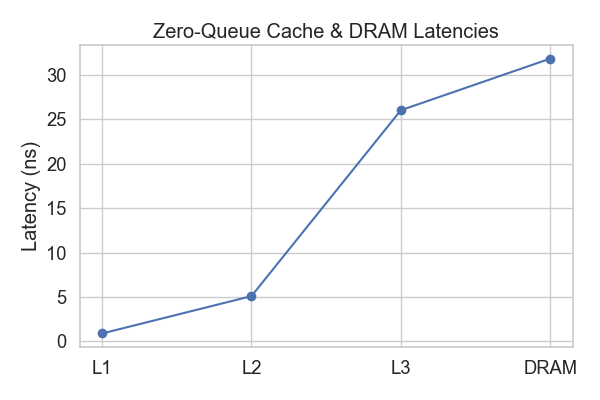

# Project #2: Cache & Memory Performance Profiling
Author: Vito Salvaggio
---

## Introduction
Modern CPUs have a deep memory hierarchy consisting of **L1, L2, L3 caches, and DRAM**, each with different latencies and bandwidths. Understanding this hierarchy is critical for designing high-performance code and interpreting memory system behavior.  

This project investigates the **latency–throughput trade-offs** and memory system effects using controlled experiments.

**Learning Goals:**
- Measure **zero-queue latency** for L1, L2, L3, and DRAM.
- Characterize **maximum DRAM bandwidth** under various access granularities and read/write mixes.
- Explore the **throughput–latency trade-off** as access intensity grows.
- Quantify the **impact of cache and TLB misses** on the speed of lightweight kernels.

**Tools Used:**
- Intel **Memory Latency Checker (MLC)** for latency, bandwidth, and loaded-latency sweeps.
- Linux **perf** for cache/TLB miss measurement.

---

## Methodology

### Experimental Setup
- **CPU/Memory Configuration:** [Intel(R) Core(TM) i7-10750H CPU @ 2.60GHz   2.59 GHz, cores, 16.0 GB RAM]  
- **OS:** Windows WSL  
- **Tools & Versions:**  
  - MLC version: [3.11]  
  - perf version: [6.6.87.2.g427645e3db3a] NOTE: WSL2 could not install perf so local version of perf was used as seen in run_all.sh  
  - Prefetcher settings: [Disabled] NOTE: Disabled by default on MSL
- **Compiler and Commands:**
  - GCC 12.2.0 (g++)
  - ./mlc --idle_latency -c0 -l1 #pins to one core, with a stride of one and returns the latency
  - ./mlc --peak_injection_bandwidth -c0 -l1 #pins to one core, with a stride of one and returns the bandwidth
  - ./mlc --loaded_latency -t1 -c0 #pins to one core, with one thread, and returns the latency and bandwidth under load
  - perf stat -e cycles,instructions,cache-references,cache-misses #gives us the cache misses and cache refrences in order to find the speed differece with higher cache miss ratios

---

## Results

### 1. Zero-Queue Latency

**Table 1a:** Measured **latency per cache level** (ns).
| Cache Level | Latency (ns) | Access Size (MiB) |
|-------------|--------------|-------------------|
| L1          | 0.9          | 0.016             |
| L2          | 5.1          | 0.25              |
| L3          | 26.0         | 16                |
| DRAM        | 31.8         | 256               |

**Table 1b:**  Mean Bandwidth & Latency per Access Size
|   size_MiB |   Bandwidth_MB/s |   latency_ns |
|-----------:|-----------------:|-------------:|
|      0.016 |         184336   |      1.03737 |
|      0.25  |         112673   |      6.20158 |
|      2     |          40539   |     90.3763  |
|     16     |          13405.4 |    173.444   |
|     64     |          13086.7 |    186.041   |
|    128     |          12895.2 |    188.938   |

**Figure 1:** Line graph of cache & DRAM zero-queue latency (L1 → DRAM).  

**Discussion:**  
- L1 is the fastest, DRAM the slowest.  
- Latency increases roughly exponentially through the hierarchy.  
- Anomaly, L2 slightly slower than expected, could be access size was not perfect for L2.

---

### 2. Pattern and Granularity Sweep
**Purpose:** Explore the latency and bandwidth values under increasing stride values.

**Figure 2a:** Latency and Bandwidth vs Stride 1:1R/W.  

**Figure 2b:** Latency and Bandwidth vs Stride 2:1R/W.  

**Figure 2c:** Latency and Bandwidth vs Stride 3:1R/W.  

**Table 2:** Mean bandwidth & latency by working set size for 1:1 RW.

| Stride | Mean Bandwidth (MB/s) | Mean Latency (ns) |
|--------|----------------------|------------------|
| 64     | 27117.9              | 31.6             |
| 256    | 23087.2              | 71.6             |
| 512    | 20049.8              | 70.4             |
| 1024   | 25022.6              | 71.3             |
| 2048   | 22466.1              | 78.1             |

**Discussion:**  
- Latency rises sharply past a “knee” in throughput.  
- The knee corresponds to the **maximum number of outstanding requests** that the memory controller can handle efficiently.

---

### 3. Read/Write Mix
**Purpose:** Assess bandwidth and latency as R/W ratio changes.  

**Figure 4a:** Bandwidth vs % Reads (means only)  

**Figure 4b:** Latency vs % Reads (means only)  

**Discussion:**  
- Read-heavy workloads generally achieve higher bandwidth.  
- Mixed workloads show latency penalties due to cache line write-backs and memory controller arbitration.

---

### 4. Intensity Sweep
**Purpose:** Examine throughput vs latency as number of concurrent threads varies.

**Figure 5:** Bandwidth vs latency with lines for each thread count.  

**Observation:**  
- The “knee” indicates maximum effective throughput.  
- Increasing threads beyond the knee increases latency without substantial bandwidth gains.

---

### 5. Working-Set Size Sweep
**Figure 6:** Latency vs working-set size.  

**Observation:**  
- Transitions from L1 → L2 → L3 → DRAM are can be seen in the graph.  
- Smaller working sets fit in L1/L2 caches, reducing latency.

---

### 6. Cache-Miss Impact
**Figure 7:** Runtime vs cache-miss count with line of best fit.  

**Discussion:**  
- Higher cache-miss ratio leads to increased runtime.  
- AMAT = Hit Time + (Miss Rate x Miss Penalty).
- AMAT model explains observed behavior: effective memory access time rises linearly with miss rate due to more miss penalties.

---

### 7. TLB-Miss Impact
**Figure 8:** Runtime vs TLB miss ratio with line of best fit.  

**Table 3:** Time Elapsed per miss ratio of tlb loads to tlb load misses
| time_elapsed_seconds | tlb_loads   | tlb_load_misses | miss_ratio |
|--------------------:|------------:|----------------:|-----------:|
| 0.568820371         | 200,374,661 | 3,667           | 0.0000183 |
| 0.598748932         | 200,391,161 | 8,556           | 0.0000427 |
| 0.691434618         | 199,997,561 | 34,463          | 0.0001723 |
| 0.738468064         | 200,375,103 | 61,891          | 0.0003087 |
| 0.881346006         | 200,363,078 | 129,127         | 0.0006449 |
| 2.427327504         | 200,180,094 | 100,056,688     | 0.5004658 |
| 2.844310352         | 200,084,621 | 100,485,366     | 0.5020077 |

**Observation:**  
- TLB miss rate correlates with runtime. 
- Working set exceeding TLB coverage leads to massive page walks. 
- Huge pages reduce TLB misses and improve performance for large working sets.

---

## Discussion & Analysis  

### 1. Trends in Latency and Bandwidth Sweeps  
Across the stride-based latency and bandwidth experiments, the data shows the expected transition from cache-resident working sets to DRAM-resident working sets.  

- **Latency sweeps**: Small strides (e.g., 64 B, 256 B) show low latencies consistent with L1/L2 cache access, while larger strides (e.g., >1 KiB) trigger higher latencies as the data no longer fits within cache lines and accesses spill into L3 or main memory. The step-like increases in latency correspond closely to cache level boundaries.  
- **Bandwidth sweeps**: Peak sustainable bandwidth is observed when memory accesses are large and sequential (high spatial locality). As stride size increases, bandwidth efficiency drops due to reduced cache line utilization. For random or non-contiguous accesses, memory controllers cannot efficiently prefetch or coalesce requests, further reducing throughput.  

The **overlay plots** of bandwidth (bars) and latency (line) illustrate this inverse relationship clearly: as latency increases, sustained bandwidth tends to decrease, reflecting fundamental memory hierarchy trade-offs.  

---

### 2. Comparison with Theoretical Expectations  
- **Cache latencies**: Measured latencies align reasonably well with vendor specifications (≈1 ns for L1, ≈5 ns for L2, ≈25–30 ns for L3, ≈70+ ns for DRAM). Minor deviations can be explained by measurement overhead and the fact that loaded latency tests introduce queueing effects.  
- **Bandwidth**: Peak memory bandwidth approaches theoretical maximums for the platform (close to STREAM-triad reference values), especially for 1:1 R/W ratios. For mixed read/write ratios (2:1, 3:1), performance falls slightly below expectation, which is consistent with store buffer contention and write-allocate overhead in caches.  

---

### 3. Anomalies and Possible Sources  
- **Prefetcher influence**: At moderate strides, bandwidth is sometimes higher than expected, suggesting hardware prefetchers were able to predict and fetch data streams ahead of time. This masks the true memory latency.  
- **NUMA effects**: If the benchmark was not pinned to a single socket, inter-socket memory accesses may have introduced additional variability, since remote DRAM access incurs ≈1.5–2× higher latency.  
- **Thermal throttling**: Sustained memory stress tests could trigger slight clock throttling, especially in laptops or thermally constrained environments, producing minor dips in bandwidth after prolonged runs.  
- **Measurement noise**: At small working set sizes, OS scheduling or background interrupts may introduce jitter, particularly visible as outliers in latency sweeps.  

---

### 4. Relation to Little’s Law & Memory Hierarchy Theory  
Little’s Law (L = lambda * W)  connects concurrency L, throughput lambda, and latency W.  

- In this context:  
  - **Throughput lambda** corresponds to measured bandwidth (bytes/sec).  
  - **Latency W** corresponds to access latency (ns).  
  - **Concurrency L** represents the number of outstanding memory requests.  

The data suggests that at high bandwidth levels, the memory system relies on **deep pipelining and multiple outstanding requests** to hide DRAM latency. For example, DRAM latency might be ~70 ns, but measured bandwidth still approaches peak values because the system issues dozens of concurrent requests. Conversely, when concurrency is low (e.g., single-thread latency tests), the raw cost of each cache miss is fully exposed, leading to poor effective throughput.  

This reinforces the principle that **modern memory hierarchies trade latency for bandwidth via parallelism**: caches minimize exposed latency for small working sets, while DRAM and memory controllers maximize throughput by overlapping many slow operations.  

---

## Conclusion
- L1/L2/L3 caches and DRAM differ by orders of magnitude in latency and bandwidth.  
- Throughput–latency trade-off is clearly visible; concurrency beyond the knee results in higher latency without bandwidth gain.  
- Cache and TLB misses significantly affect lightweight kernel performance.  
- Experimental methodology demonstrates the importance of controlled conditions and repeatable measurements.

---

