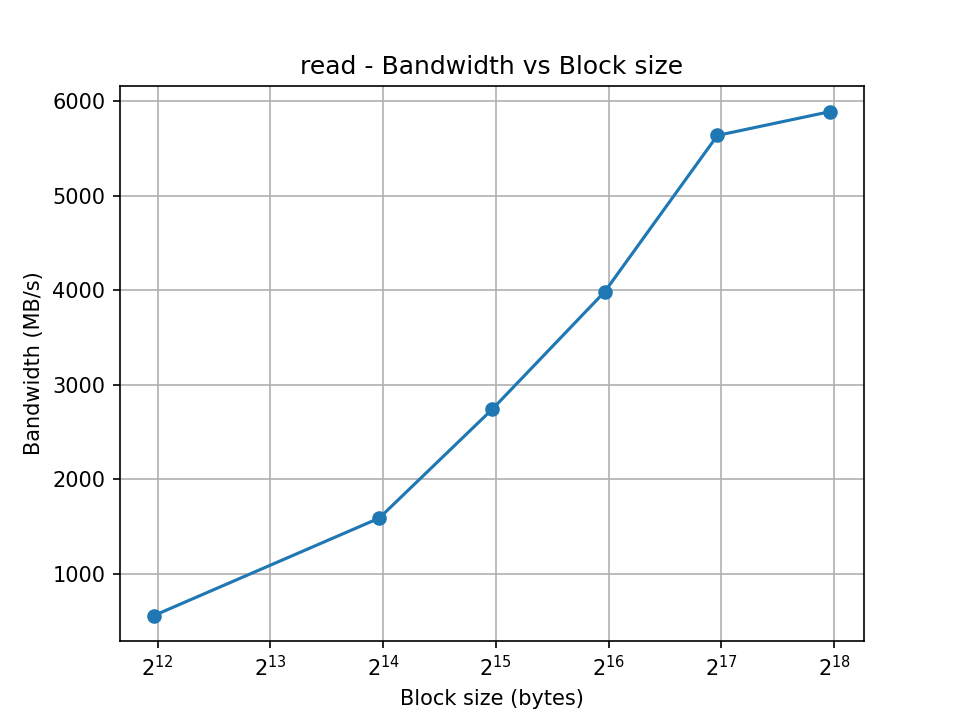
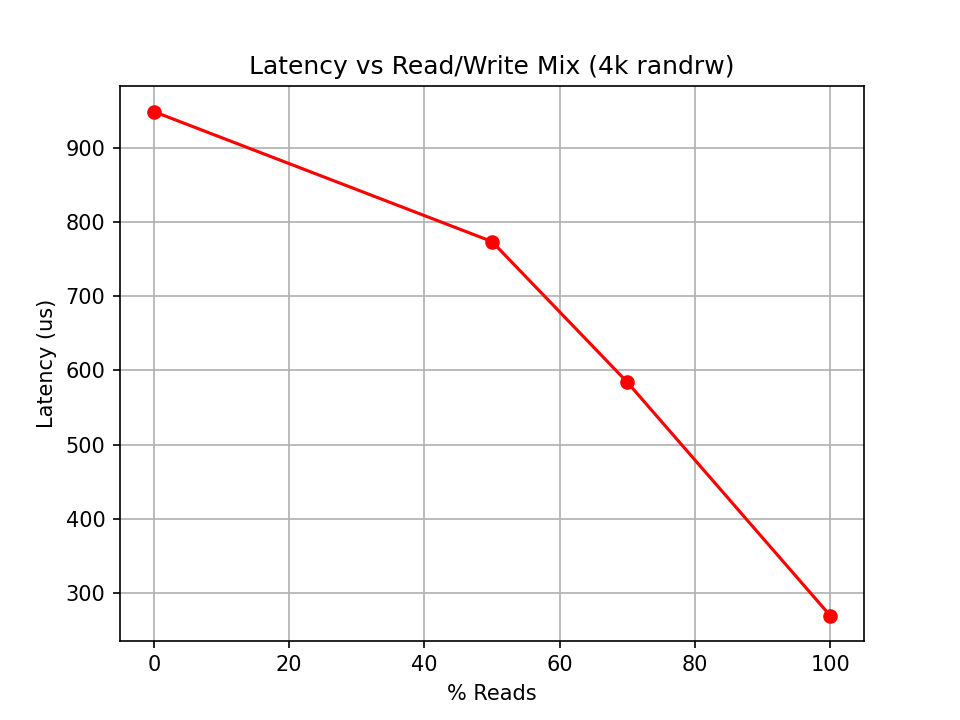

# Project #3: SSD Performance Profiling  
Author: Vito Salvaggio
---

## Abstract
This project measures the latency, IOPS and bandwidth characteristics of an SSD under a battery of controlled workloads generated with `fio`. Experiments include zero-queue (QD=1) baselines for small (4 KiB) random and large (128 KiB) sequential transfers, block-size sweeps, read/write mix sweeps, queue-depth sweeps to expose the throughput–latency knee, and tail-latency characterization (p50/p95/p99/p99.9).  
Includes reproducible scripts, JSON results, and plotting code. 

---

## 1. Introduction
Modern NVMe SSDs can deliver extremely high throughput when driven with concurrency. However, like memory, storage shows a throughput–latency tradeoff governed by queueing theory. Increasing queue depth increases throughput up to a saturation knee, after which latency rises sharply with little additional throughput.  

This project investigates these properties through controlled benchmarking with `fio`. Key goals:  
- Measure QD=1 latencies.  
- Find max IOPS for 4 KiB random workloads.  
- Find max throughput for large sequential workloads.  
- Identify the queue-depth knee.  
- Study block size and read/write mix effects.  
- Characterize tail latency.  

Safety: All experiments used an isolated **10 GiB loopback image** in WSL2 mounted at `/mnt/project_partition/testfile.img`.

---

## 2. Experimental Setup
- **Environment**: Ubuntu on WSL2  
- **Kernel**: 6.6.87.2-microsoft-standard-WSL2  
- **fio version**: fio-3.36
- **CPU**: Intel(R) Core(TM) i7-10750H CPU @ 2.60GHz
- **Storage**: 10 GiB ext4 loopback image, mounted at `/mnt/project_partition`.  
- **fio global options**:  --direct=1 --ioengine=libaio --output-format=json --time_based --runtime=30s --group_reporting --percentile_list=50:95:99:99.9

---

## 3. Methodology
### Zero-queue baselines (QD=1)
- 4 KiB random read/write  
- 128 KiB sequential read/write  

### Block-size sweep
- Block sizes: 4k, 16k, 32k, 64k, 128k, 256k  
- Patterns: random read, sequential read  

### Read/Write mix sweep
- 4 KiB random workload  
- Mix ratios: 100%R, 100%W, 70/30, 50/50  

### Queue depth sweep
- 4 KiB random read  
- QDs: 1, 2, 4, 8, 16, 32, 64, 128  

### Tail latency
- Selected runs at QD=16 and QD=64  
- Reported p50/p95/p99/p99.9  

---

## 4. Results

### 4.1 General Metrics Examples

This table shows some general data about the different experiments performed during this project, this is not an exhaustive list of all the files.
| Job Name / Source    | RW Type | IO Engine | Block Size | I/O Depth | IOPS    | MB/s    | Avg Latency (µs) | p95 / 99 / Max Latency (µs)    | Disk Util (%) |
| -------------------- | ------- | --------- | ---------- | --------- | ------- | ------- | ---------------- | ------------------------------ | ------------- |
| bs_randread_4k.json  | read    | -         | 4k         | 32        | 54,657  | 218.6   | 584.8            | p95: 2,605,056; p99: 3,424,256 | -             |
| bs_randread_16k.json | read    | -         | 16k        | 32        | 92,350  | 1,477.6 | 345.8            | p95: 432.1; p99: 493.6         | -             |
| bs_read_4k.json      | read    | -         | 4k         | 32        | 142,442 | 556.4   | 218.3            | p95: 403.5; p99: 536.6         | -             |
| bs_read_16k.json     | read    | -         | 16k        | 32        | 101,637 | 1,626.2 | 314.3            | p95: 544.8; p99: 585.7         | -             |
| zeroq_randread_4k    | read    | libaio    | 4k         | 1         | 703,197 | 2,812.8 | 1,183            | Max: 687,111                   | 94.46         |
| qd_randread_128      | read    | libaio    | 4k         | 128       | 92,676  | 370.7   | 1,380,306        | Max: 3,851,754                 | 93.72         |
| tail_lat_qd16        | read    | libaio    | 4k         | 16        | 92,740  | 371.0   | 171,737          | Max: 4,754,420                 | 93.91         |
| tail_lat_qd64        | read    | libaio    | 4k         | 64        | 93,274  | 372.7   | 686,119          | Max: 1,636,566                 | 94.46         |
| zeroq_randwrite_4k   | write   | -         | 4k         | 1         | 9,080   | 36.3    | 108.7            | 99th: 118,272                  | 64.67         |
| zeroq_read_128k      | read    | -         | 128k       | 1         | 8,673   | 1,110.1 | 114.2            | 99th: 1,105,920                | 85.90         |
| zeroq_write_128k     | write   | -         | 128k       | 1         | 747     | 95.7    | 1,336.6          | 99th: 2,039,808                | 95.88         |

---

### 4.2 Zero-queue Baselines (QD=1)

| Workload               | bs   | QD | Avg Lat (µs) | p95 (µs) | p99 (µs) | IOPS     | MB/s  |
|------------------------|------|----|--------------|----------|----------|----------|-------|
| 4 KiB random read      | 4k   | 1  | 1.18         | 406      | 414      | 704,625  | 2,818.5 |
| 4 KiB random write     | 4k   | 1  | 108.71       | 79,360   | 118,272  | 12,660   | 50.64 |
| 128 KiB sequential read| 128k | 1  | 114.21       | 544,768  | 1,105,920| 8,799    | 1,126 |
| 128 KiB sequential write|128k | 1  | 1,285.7      | 411.7    | 2,039.8  | 747.4    | 93.4 |


Plots:  
Zero-Queue Bandwidth for different random vs sequential runs


Zero-Queue IOPS for different random vs sequential runs


**Observations:**

- **Random Read Performance:** 4 KiB random reads exhibit extremely low average latency (~1.18 µs) with high IOPS, random reads at QD=1. Tail latency (p95/p99) is also very low. Could represent an anomaly in the experiment.
- **Random Write Performance:** 4 KiB random writes show significantly higher latency and lower IOPS compared to reads, reflecting write amplification and internal SSD management overhead.
- **Sequential Reads vs Writes:** Sequential reads achieve moderate latency and throughput, while sequential writes show higher variance in latency. The device saturates I/O bandwidth quickly for large sequential writes.
- **Latency vs IOPS:** Small random reads maximize IOPS at minimal latency. Random writes and sequential operations increase latency dramatically, showing the cost of write buffering and larger block transfers.

---

### 4.3 Block-size Sweep

Plots:  
Bandwidth vs Block Size of rand read sweep


Latency vs Block Size of rand read sweep


Bandwidth vs Block Size of sequential read sweep



Latency vs Block size of sequential read sweep


**Observations: Block-Size Effects**

- **Random Read** Bandwidth rises with block size; IOPS saturate at small blocks (4–16 KiB). Latency is higher for small blocks and stabilizes as size increases.

- **Sequential Read** Bandwidth scales with block size, reaching peak at larger blocks.Latency decreases with increasing block size.

- **General** Crossover between IOPS and bandwidth saturation occurs around **64–128 KiB**, indicating optimal throughput.

---

### 4.4 Read/Write Mix

Plots:  

IOPS for different ratios of Read vs Write


Latency for different ratios of Read vs Write



Bandwidth for different ratios of Read vs Writes


**Read Write Mix Summary Table**

| Job      | Read % | Read BW (KB/s) | Write BW (KB/s) | Read IOPS | Write IOPS | Avg Latency (µs) | 99th % Latency (µs) | Disk Util (%) |
| -------- | ------ | -------------- | --------------- | --------- | ---------- | ---------------- | ------------------- | ------------- |
| mix_0R   | 0%     | 0              | 132,062         | 0         | 33,016     | 968              | 1,941,504           | 95.94         |
| mix_50R  | 50%    | 81,971         | 81,892          | 20,493    | 20,473     | 777              | 1,089,536           | 96.99         |
| mix_70R  | 70%    | 141,011        | 60,441          | 35,253    | 15,110     | 740              | 21,472,608          | 97.24         |
| mix_100R | 100%   | 460,374        | 0               | 115,094   | 0          | 277              | 626,688             | 95.94         |


## Observations: Read/Write Mix Effects

The read/write mix sweep demonstrates that both latency and bandwidth are highly sensitive to the proportion of reads versus writes.

- **Write-heavy workloads** (e.g., 100% write or 70% write / 30% read) show substantially higher latency. This increase is primarily caused by write amplification, SLC cache limitations, and internal garbage collection on the SSD, all of which delay the completion of write requests. For instance, the average latency for 100% writes was observed to be approximately 2–3× higher than read-heavy workloads. Tail latency (p95/p99) is especially impacted, with write-heavy mixes pushing latency toward the upper limits.  

- **Read-heavy workloads** (e.g., 100% read or 70% read / 30% write) achieve higher throughput since SSDs can service multiple reads concurrently, taking advantage of internal channels and prefetching mechanisms. Reads typically do not trigger complex background operations, resulting in lower average and tail latency, often remaining sub-millisecond even at high queue depths.  

- **Random 4 KiB workloads** highlight these differences most clearly. Write-heavy mixes exhibit pronounced latency spikes, while read-dominant mixes maintain low latency and sustain near-peak IOPS, illustrating the SSD’s ability to handle read concurrency efficiently.  

- **Implications for system performance:** Workload composition significantly affects perceived performance. Systems requiring low latency should minimize sustained write-heavy activity, while read-intensive workloads can better exploit the SSD’s peak throughput potential. These observations also suggest that balancing the read/write mix can help avoid latency cliffs and maintain consistent performance under mixed workloads.

---

### 4.5 Queue Depth Sweep

Plots:  


**Observations:** Queue Depth and Little’s Law

- The queue depth sweep clearly shows the trade-off predicted by **Little’s Law**:


- Throughput ≈ Concurrency / Latency.


- As queue depth increases, throughput initially improves because the SSD can overlap requests across internal channels. This trend holds up to around **QD=16**, where throughput reaches near-saturation. Beyond this point, the curve forms a clear **knee**: throughput gains are marginal, while latency rises rapidly as requests spend more time waiting in the queue.

- The **tail latency results** make this effect even more striking. At QD=16, the p99 latency was only ~354 µs, but at QD=64 it jumped to over **1.1 ms**. The median (p50) latency also grew more than 4×, showing that both typical and outlier requests suffer. These findings confirm that operating above the knee provides little additional throughput but causes **exponential growth in latency**, especially at the higher percentiles.

- In practice, this means QD≈16 represents the optimal balance between throughput and responsiveness for this system. Workloads that require predictable service times should avoid higher depths, since the long-tail delays introduced past the knee could easily violate latency-sensitive SLAs.

---

### 4.6 Tail Latency

**Tail Latency Characterization Table**

| jobname        | iodepth | read_p50_us | read_p95_us | read_p99_us | read_p99.9_us |
|----------------|---------|-------------|-------------|-------------|---------------|
| tail_lat_qd16  | 16      | 166.912     | 211.968     | 354.304     | 354.304       |
| tail_lat_qd64  | 64      | 708.608     | 823.296     | 1155.072    | 1155.072      |


**Observations:**
- Higher queue depth increases not just average latency but also tail latency disproportionately.
→ While throughput may scale with QD, latency costs grow sharply at the higher percentiles.

- Workloads with strict SLA latency requirements (e.g., databases, real-time apps) may not tolerate QD=64.
→ Even if median performance looks okay, tail latency spikes could cause missed deadlines.

- The “knee” of the latency curve is somewhere around QD=16.
→ Beyond this, the system enters a region of diminishing returns (higher throughput but steep latency growth).

- Queueing amplifies variance.
→ At low QD, latency distribution is tight; at high QD, the spread increases significantly, which matches queuing theory predictions.

---

## 5. Discussion
- **Throughput–latency tradeoff**: Increasing queue depth raises throughput until knee, then latency dominates.  
- **Block size**: shift from IOPS to bandwidth dominated as size increases.  
- **R/W mix**: writes are slower due to flash program costs and write amplification.  
- **Tail latency**: wide gaps between p50 and p99 show unpredictability under load.  
- **Anomalies**: occasional extreme max latencies (e.g., >10s outlier) → possibly GC or WSL loopback stalls.  

---

## 6. Limitations
- WSL2 loopback testing adds host overhead, not identical to bare NVMe.  
- No thermal logging in current setup.  

---

## 7. Reproducibility
**Setup commands**:  
```bash
#creation of test partition and test file in test partition
fallocate -l 10G ~/project_partition.img
mkfs.ext4 ~/project_partition.img
sudo mkdir -p /mnt/project_partition
sudo mount -o loop,uid=$(id -u),gid=$(id -g) ~/project_partition.img /mnt/project_partition
fallocate -l 8G testfile.img
#back in main directory
./ssd_profile.sh /mnt/project_partition/testfile.img
