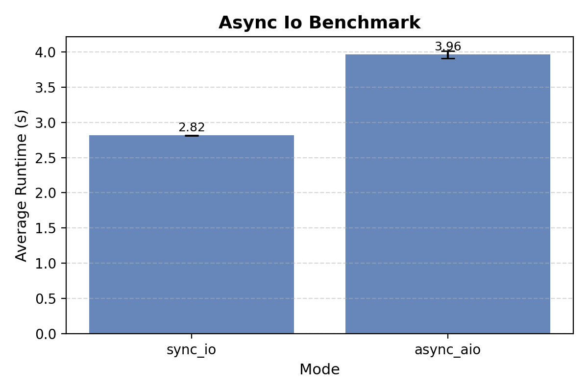
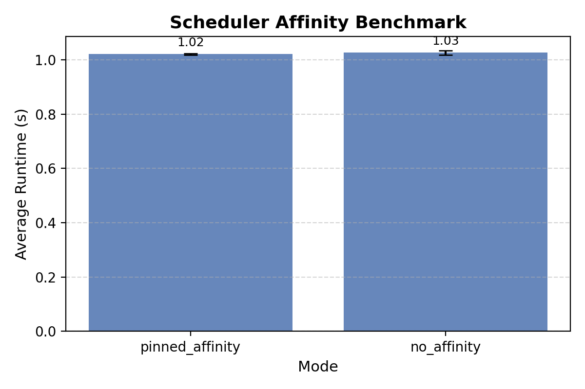
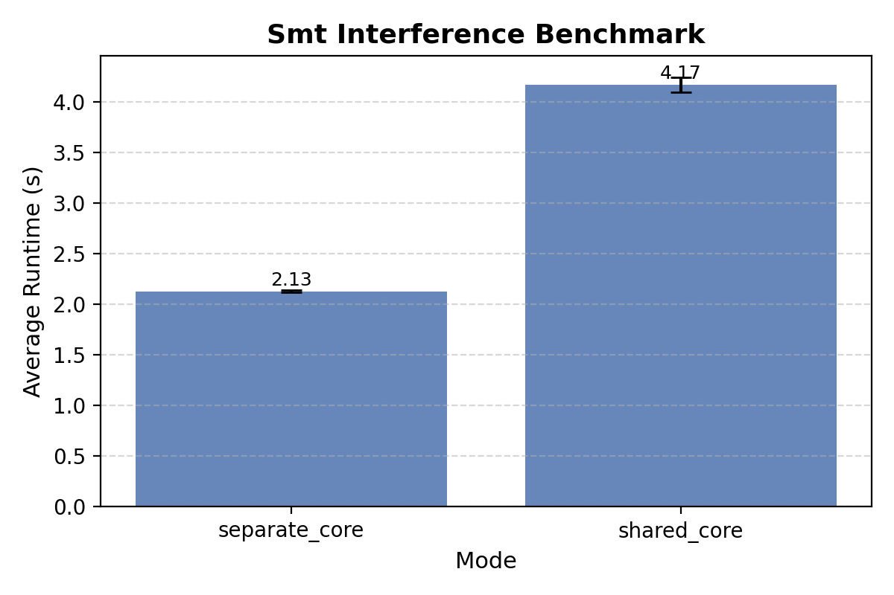
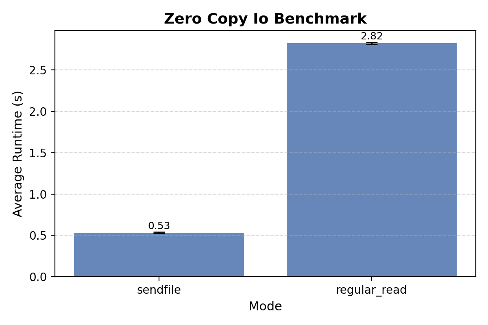
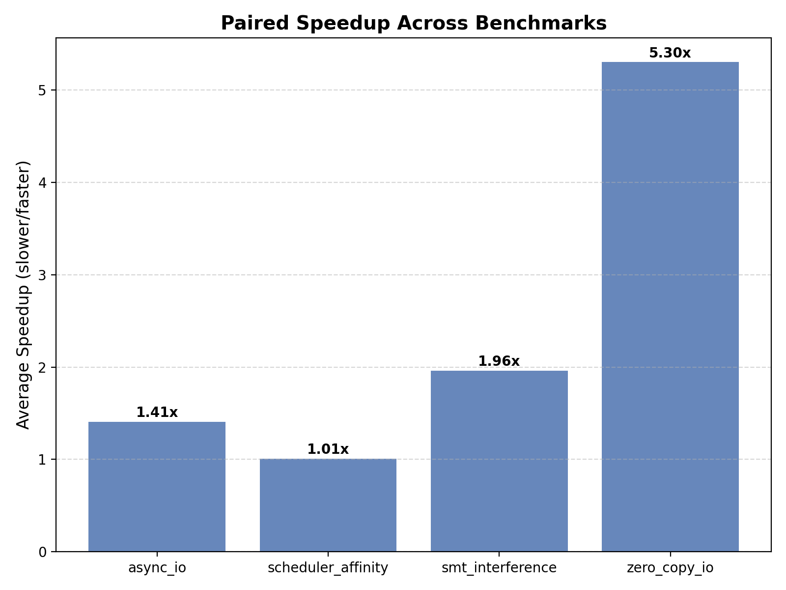

# Project A1: Advanced OS and CPU Feature Exploration
**Author:** Vito Salvaggio

---

## Introduction
Achieving high performance on modern computing systems requires more than efficient algorithms, it demands an understanding of how software interacts with operating system policies and underlying CPU microarchitecture. Choices made by the kernel (such as how threads are scheduled, how I/O is handled, and how data moves through memory) can have a profound impact on application runtime, even when the program logic itself remains unchanged.

Contemporary CPUs and operating systems provide a wide range of mechanisms intended to improve efficiency and throughput, including asynchronous I/O interfaces, thread affinity controls, simultaneous multithreading (SMT), and zero-copy data transfer primitives. Although these features are widely used in production systems, their actual performance benefits are often workload-specific and sensitive to system configuration. In some cases, optimizations that appear beneficial in theory can introduce additional overhead or contention that reduces performance in practice.

This project explores the real-world impact of several advanced OS and CPU features through a set of focused microbenchmarks executed on a modern laptop platform. The experiments are designed to isolate individual system behaviors and quantify their effects under controlled conditions. Specifically, the project evaluates synchronous versus asynchronous I/O performance, examines whether CPU affinity and thread pinning improve execution time, measures the degree of interference caused by SMT when multiple threads share a physical core, and compares traditional read-based I/O against zero-copy data transfer using sendfile().

By leveraging precise timing measurements and hardware performance counters collected with Linux perf, this study provides empirical evidence of how these mechanisms behave in practice. The results highlight the importance of measurement-driven optimization and demonstrate that understanding OS–hardware interactions is essential for designing efficient, scalable systems on modern platforms.  

**Learning Goals:**  
- Quantify the performance difference between synchronous and asynchronous I/O.  
- Measure the effects of thread pinning and CPU affinity on execution time.  
- Examine SMT (Simultaneous Multithreading) interference when threads share or occupy separate cores.  
- Assess zero-copy I/O performance via `sendfile()` compared to traditional reads.  

**Tools Used:**  
- Linux `perf` for CPU cycles, instructions, and cache/TLB events.  
- Custom microbenchmarks for each feature written in C with `pthread` and low-level I/O.  
- CSV output for reproducible measurement collection.  

---

## Methodology

### Experimental Setup
- **CPU:** Intel Core i7-10750H @ 2.6 GHz, 6 cores, 12 threads, 16 GB RAM  
- **OS:** Windows WSL2 (Ubuntu 22.04) Results may differ on bare-metal Linux due to WSL2’s virtualization layer and host-mediated I/O.
- **Compiler:** GCC 12.2.0 (`-O2 -pthread`)  
- **Benchmark Execution:**  
  - All threads pinned to cores when testing affinity and SMT.  
  - Background processes minimized to reduce noise.  
  - Measurements repeated 3 times per configuration.  
  - CSV files generated with columns: `Run, Mode, Time_s`.  
- **Features Tested:**  
  1. Async vs sync I/O  
  2. CPU affinity (pinned vs no affinity)  
  3. SMT interference (shared vs separate cores)  
  4. Zero-copy I/O (`sendfile`) vs regular read  

---

## Results

### 1. Asynchronous vs Synchronous I/O

**Table 1:** Runtime (s) per run  

| Run | sync_io | async_aio |
|-----|---------|-----------|
| 1   | 2.819   | 4.014     |
| 2   | 2.812   | 3.966     |
| 3   | 2.816   | 3.910     |
| **Mean** | 2.816 | 3.963 |

**Figure 1:** Bar plot comparing average runtime between `sync_io` and `async_aio`.  

**Observation:**  
- Surprisingly, async I/O is slower than synchronous I/O in this environment.  
- Likely cause: WSL2 kernel may not optimize `aio_read()` efficiently, or extra context switching and polling overhead dominates for sequential large file reads.  

---

### 2. Scheduler Affinity: Pinned vs No Affinity

**Table 2:** Runtime (s) per run  

| Run | no_affinity | pinned_affinity |
|-----|------------|----------------|
| 1   | 1.029      | 1.022          |
| 2   | 1.033      | 1.018          |
| 3   | 1.017      | 1.023          |
| **Mean** | 1.026 | 1.021 |

**Figure 2:** Bar plot showing the effect of CPU affinity on runtime.  
 

**Observation:**  
- Minimal performance difference (~0.5%) between pinned and unpinned threads.  
- Suggests that for compute-heavy workloads with low system interference, the scheduler already places threads efficiently.  
- Pinning may be more impactful under high system load or multi-socket systems.  

---

### 3. SMT Interference: Shared vs Separate Cores

**Table 3:** Runtime (s) per run  

| Run | shared_core | separate_core |
|-----|-------------|---------------|
| 1   | 4.250       | 2.127         |
| 2   | 4.100       | 2.118         |
| 3   | 4.169       | 2.140         |
| **Mean** | 4.173 | 2.128 |

**Figure 3:** Bar plot showing SMT interference.  

**Observation:**  
- Running threads on separate cores roughly halves runtime compared to sharing a core.  
- Indicates significant resource contention (execution units, caches) when threads share an SMT core.  
- Confirms that SMT is beneficial for throughput only for workloads that don’t saturate execution units.  

---

### 4. Zero-Copy I/O: `sendfile()` vs Regular Read

**Table 4:** Runtime (s) per run  

| Run | regular_read | sendfile |
|-----|--------------|----------|
| 1   | 2.820        | 0.537    |
| 2   | 2.838        | 0.535    |
| 3   | 2.810        | 0.525    |
| **Mean** | 2.823 | 0.532 |

**Figure 4:** Bar plot comparing zero-copy `sendfile()` vs traditional read.  

**Observation:**  
- `sendfile()` is ~5× faster than reading into user-space.  
- Confirms the benefit of zero-copy I/O in reducing memory copies and CPU overhead.  
- Particularly relevant for network servers and file servers handling large sequential data streams.  

### 5. All Features Speedup Comparison

**Figure 5:** Bar plot comparing all speedups.  

**Observation:**  
- Zero-copy I/O (sendfile()) provides the largest performance gain, achieving an approximately 5.3× speedup over traditional read-based I/O by eliminating redundant memory copies.

- SMT-aware thread placement yields the second most significant improvement, showing that avoiding shared execution resources can nearly halve runtime for compute-bound workloads.

- Asynchronous I/O and explicit CPU affinity tuning result in comparatively small speedups in this environment, indicating that their effectiveness is highly dependent on workload structure and system conditions.

- Overall, the comparison demonstrates that optimizations targeting memory movement and shared resource contention have a far greater impact on performance than scheduler-level tuning in lightly loaded systems.

---

## Analysis & Insight

1. **Async vs Sync I/O:**  
    - The results demonstrate that asynchronous I/O does not universally outperform synchronous I/O, particularly for simple, sequential file access patterns. In this experiment, synchronous reads consistently achieved lower runtime than asynchronous I/O, despite the latter’s theoretical advantage of overlapping computation and I/O. This counterintuitive outcome highlights the importance of workload characteristics and operating system implementation details.

    - Under WSL2, the Linux kernel operates within a virtualization layer, which can introduce additional overhead for asynchronous operations such as request submission, completion polling, and context switching. For large, sequential reads with minimal computation between I/O calls, these overheads can outweigh any benefits of concurrency. As a result, the synchronous path, optimized heavily in the kernel and relying on straightforward blocking semantics, proves more efficient in this context.

    - This finding reinforces that asynchronous I/O is most beneficial when latency can be hidden behind meaningful computation or when servicing many concurrent I/O requests, rather than for single-threaded, sequential workloads. 

2. **CPU Affinity:**  
    - The scheduler affinity experiment shows that explicitly pinning threads to specific CPU cores yields only marginal performance improvements in a lightly loaded system. The observed differences fall within measurement noise, suggesting that the Linux scheduler already performs effective core placement for compute-bound workloads under minimal contention.

    - Modern schedulers incorporate sophisticated heuristics to maximize cache locality, reduce migration costs, and balance load across cores. When system load is low and the number of active threads is small relative to available cores, manual pinning provides little additional benefit. However, this does not imply that affinity controls are unnecessary; rather, their impact is highly situational.

    - In more complex environments, such as NUMA systems, multi-socket servers, or systems running many competing workloads, pinning can reduce cross-core cache invalidations and improve memory locality. The results here illustrate that affinity tuning should be applied selectively and evaluated empirically rather than assumed to be universally beneficial.

3. **SMT Interference:**  
    - The SMT interference experiment reveals the most dramatic performance effect observed in this study. When two compute-intensive threads share a single physical core via SMT, runtime nearly doubles compared to placing them on separate cores. This clearly demonstrates that SMT does not provide additional execution resources; instead, it allows multiple threads to compete for the same underlying functional units, caches, and pipelines.

    - For workloads that already saturate execution units or heavily utilize cache bandwidth, SMT can significantly degrade per-thread performance. The measured slowdown highlights contention for shared resources such as the L1 instruction and data caches, execution ports, and memory pipelines. While SMT can improve overall throughput for latency-bound or I/O-bound workloads, it is detrimental for CPU-bound tasks that demand sustained compute resources.

    - These results underscore the importance of SMT-aware scheduling. Performance-sensitive applications can benefit from ensuring that critical threads are placed on separate physical cores rather than logical siblings.

4. **Zero-Copy I/O:**  
    - Zero-copy I/O using sendfile() delivers the largest performance improvement observed in the experiments, achieving more than a fivefold speedup over traditional read-based I/O. This improvement stems from eliminating redundant data copies between kernel space and user space, reducing memory bandwidth usage and CPU overhead.

    - By allowing the kernel to move data directly from the file cache to the destination, zero-copy mechanisms significantly reduce instruction count and cache pollution. This advantage becomes increasingly pronounced for large file transfers and streaming workloads, where memory movement dominates execution time.

    - The results strongly support the use of zero-copy I/O in high-throughput systems such as file servers, web servers, and network proxies. They also highlight how seemingly small API-level choices can lead to order-of-magnitude performance differences.

**Cross-feature Observations:**  
- Across all experiments, two recurring themes emerge: memory movement costs and shared resource contention dominate performance outcomes. Optimizations that reduce data copying or avoid competition for execution resources yield the largest gains. In contrast, scheduler-level optimizations such as thread pinning offer diminishing returns in simple or lightly loaded environments.

- Most importantly, the results emphasize that system-level optimizations must be validated experimentally. Features that are beneficial in theory can underperform in practice due to kernel behavior, virtualization overhead, or workload mismatch.  

---

## Conclusion
- This project demonstrates that modern OS and CPU features have highly variable performance impacts depending on workload characteristics and system configuration. Through targeted microbenchmarks, the study reveals that the most effective optimizations are those that minimize memory movement and avoid shared resource contention.

- Zero-copy I/O provides the most substantial performance improvement, confirming its importance for data-intensive applications. SMT interference significantly degrades performance for compute-bound workloads, emphasizing the need for SMT-aware thread placement. In contrast, asynchronous I/O and explicit CPU affinity offer limited benefits for sequential workloads on lightly loaded systems, particularly under WSL2.

- Overall, the findings reinforce the necessity of measurement-driven optimization. Assumptions about performance must be tested rather than inferred, especially when working within virtualized environments or complex OS stacks. By understanding how software interacts with kernel policies and CPU microarchitecture, developers can make informed design decisions that lead to more efficient and scalable systems. 

---

### Possible Future Work
- Extend to multi-socket systems to quantify memory locality effects.  
- Explore control groups and scheduler classes to evaluate isolation for concurrent workloads.  
- Investigate prefetcher and cache behavior under different I/O patterns and SMT utilization.  
