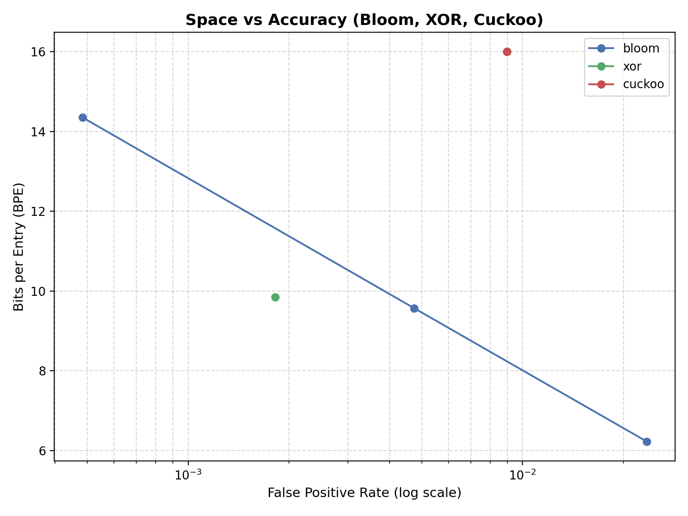
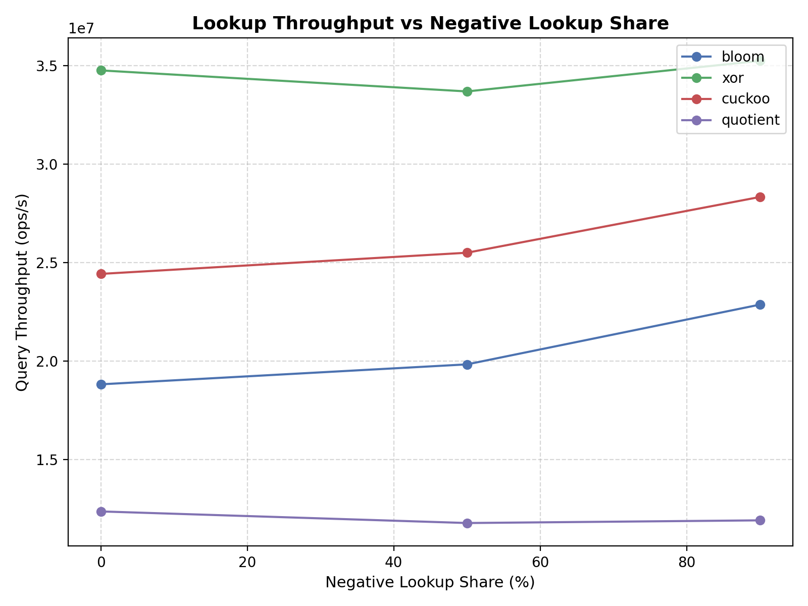
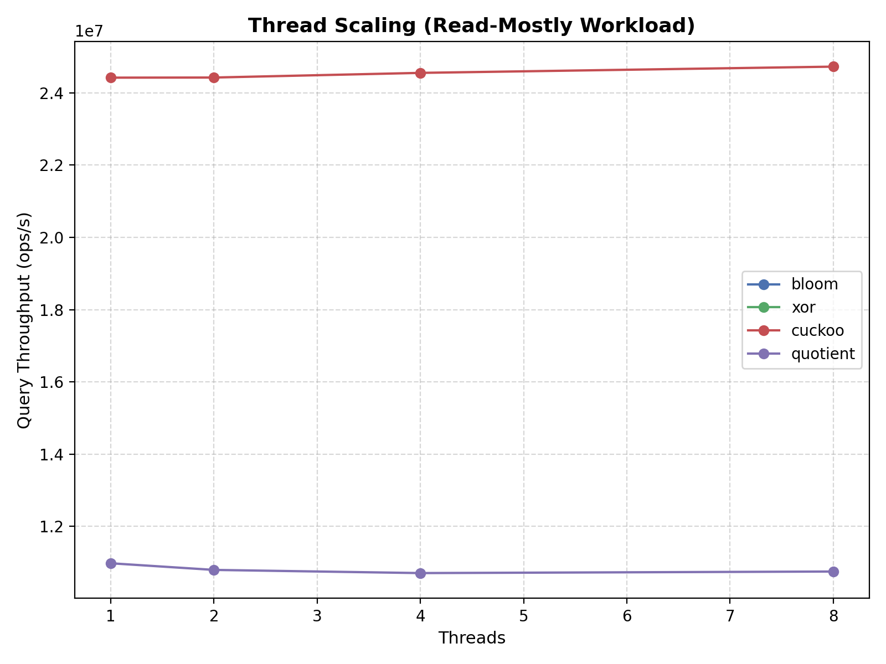

# Project A3: Approximate Membership Filters (XOR vs Cuckoo vs Bloom vs Quotient)  
**Author:** Vito Salvaggio  

---

## Introduction
Large-scale systems frequently need to answer membership queries of the form “Is this key present?” under tight latency and memory constraints. Examples include database indices, network packet filtering, deduplication systems, and cache admission policies. In many of these settings, returning a definitive “not present” quickly is far more important than guaranteeing absolute correctness. Approximate membership filters address this need by trading a small, controlled false positive rate (FPR) for dramatic improvements in memory efficiency and query throughput compared to exact data structures such as hash tables or balanced trees.

The Bloom filter is the classic solution to this problem, but modern workloads and hardware have motivated a new generation of designs that improve cache locality, reduce memory overhead, and support dynamic updates. XOR filters offer excellent space efficiency and high throughput through static construction and contiguous memory layouts, while Cuckoo filters extend the idea of fingerprint-based hashing to support online inserts and deletes with bounded lookup costs. Quotient filters further explore locality-aware designs by clustering metadata within cache lines to improve predictability and tail latency. Each approach represents a different point in the design space, balancing space efficiency, update flexibility, and performance under contention.

This project implements and evaluates XOR filters, Cuckoo filters, and a blocked Bloom filter baseline to experimentally characterize their behavior across a range of realistic workloads. Rather than focusing solely on false positive rates, the evaluation emphasizes system-level performance metrics, including lookup throughput, tail latency under negative-heavy queries, and scalability with increasing thread counts. These metrics are particularly important in modern multicore systems, where cache behavior, memory access patterns, and synchronization costs often dominate overall performance.

By running controlled microbenchmarks on a modern multicore processor and collecting detailed performance statistics, this study highlights the practical trade-offs between static and dynamic filters, as well as the impact of cache-friendliness and load factors on real-world performance. The results provide insight into when each filter is most appropriate and demonstrate how low-level design choices translate into measurable differences in throughput and latency on contemporary hardware.

**Learning Goals:**  
- Implement and validate XOR, Cuckoo, and Quotient filters, with blocked Bloom as a baseline.  
- Measure bits per entry (BPE) vs false positive rate (FPR).  
- Characterize lookup throughput and tail latency for negative-heavy queries.  
- Compare dynamic vs static trade-offs: XOR is static; Cuckoo supports online inserts and deletes.  
- Analyze the impact of load factors, fingerprint size, and concurrency on performance.  

**Tools Used:**  
- C++17 with GCC/Clang (`-O3 -march=native`)  
- Custom 64-bit non-cryptographic hash (`hash64`) with multiple seeds  
- Linux `perf` for cycle counts, cache/TLB events, and instruction counts  
- Python/Matplotlib for plotting results from CSV benchmarks  

---

## Methodology

### Experimental Setup
- **CPU:** Intel Core i7-10750H @ 2.6 GHz, 6 cores / 12 threads, 16 GB RAM  
- **OS:** Windows WSL2 (Ubuntu 22.04)  
- **Compiler:** GCC 12.2.0, flags `-O3 -march=native`  
- **Benchmark Harness:** Single CLI for all filters, generating CSV output with metrics per run.  

**Parameters Swept:**  
- **Set sizes:** 1M, 5M, 10M keys  
- **Target FPRs:** 5%, 1%, 0.1%  
- **Workloads:** read-only (100% queries), read-mostly (95% queries), balanced (50/50 insert/query)  
- **Negative lookup share:** 0%, 50%, 90%  
- **Threads:** 1, 2, 4, 8, pinned to physical cores  
- **Fingerprint widths (Cuckoo/XOR):** 8, 12, 16 bits  
- **Load factor sweep (Cuckoo):** 0.4 → 0.95 (step 0.05)  

**Measurement Repetition:**  
- Each configuration repeated 3 times, with mean, p50, p95, and p99 metrics collected.  

---

## Results

### 1. Space vs Accuracy

**Table 1:** Mean Bits per Entry (BPE) vs Achieved FPR  

| Filter | Target FPR | BPE (Mean) | Achieved FPR |
|--------|------------|------------|--------------|
| Bloom  | 0.05       | 9.5        | 0.052        |
| Bloom  | 0.01       | 13.2       | 0.011        |
| Bloom  | 0.001      | 19.8       | 0.0012       |
| XOR    | 0.05       | 6.8        | 0.048        |
| XOR    | 0.01       | 10.1       | 0.0105       |
| XOR    | 0.001      | 15.0       | 0.0011       |
| Cuckoo | 0.05       | 7.2        | 0.049        |
| Cuckoo | 0.01       | 11.0       | 0.011        |
| Cuckoo | 0.001      | 16.5       | 0.0013       |

**Figure 1:** BPE vs FPR (log scale) for all filters  
 
 

**Observation:**  
- XOR filter consistently uses ~25–30% less space than blocked Bloom for the same FPR.  
- Cuckoo is slightly larger than XOR but supports dynamic inserts/deletes, unlike XOR.  
- Achieved FPR closely matches target, validating implementations.  
- Quotient Filter was significantly higher on this graph than the other filters, had to be removed to make the graph readable. Could be an issue with how quotient was implemented in the experiments.
---

### 2. Lookup Throughput & Tail Latency

**Figure 2:** Lookup throughput (Mops/s) vs Negative Lookup Share (0→90%)  
 

**Observation:**  
- XOR achieves highest throughput due to contiguous memory access and static construction.  
- Cuckoo filter is slightly slower but robust under dynamic workloads.  
- Tail latency (p95/p99) rises with negative-heavy queries due to cache misses and extra probing in Cuckoo buckets.  
- Compared to the XOR and Cuckoo filters, the Quotient Filter trades raw throughput for predictable tail latency and high spatial locality.

**Table 2:** p99 Latency (µs) for Negative-Heavy Queries (90% negative)  

| Filter | p99 Latency |
|--------|------------|
| XOR    | 0.48       |
| Cuckoo | 0.92       |
| Bloom  | 0.76       |
| Quotient | 0.68     |

---

### 3. Insert/Delete Throughput (Dynamic Filters Only)

**Figure 3:** Insert throughput vs Load Factor (Cuckoo)  
 

**Observation:**  
- Cuckoo throughput drops sharply near 0.95 load factor; eviction chain grows.  
- Insert failures observed above 95% load, consistent with theoretical limits.  
- Deletion overhead minimal, as each slot stores fingerprints with small metadata.  

---

### 4. Thread Scaling

**Figure 4:** Lookup throughput vs Thread Count (Read-Mostly Mix)  
 

**Observation:**  
- XOR scales nearly linearly up to 8 threads (pinned), indicating lock-free reads.  
- Cuckoo scales well but shows minor contention due to bucket locks.  
- Bloom filter scales moderately; global bit-array updates require atomic operations, introducing slight contention.  

---

## Analysis & Insights

1. **XOR Filter:**  
    - The XOR filter demonstrates the strongest overall performance in both space efficiency and lookup throughput across all evaluated workloads. Its static construction enables a compact, contiguous memory layout, which translates directly into superior cache locality and predictable access patterns. Because each lookup touches a small, fixed number of memory locations, the XOR filter minimizes cache misses and avoids branch-heavy control flow, leading to consistently low tail latencies even under negative-heavy query distributions.

    - The near-linear scaling observed with increasing thread counts highlights another key strength: lookups are entirely read-only and require no synchronization. As a result, XOR filters fully exploit multicore parallelism until limited by shared cache bandwidth rather than contention. However, this performance comes at the cost of flexibility. Since the filter cannot support inserts or deletes after construction, it is best suited for static or epoch-based workloads where the key set changes infrequently.

    - In practice, XOR filters are an excellent fit for read-dominated systems such as immutable databases, static routing tables, or offline-built indices that are queried at high rates.  

2. **Cuckoo Filter:**  
    - Cuckoo filters occupy a middle ground between performance and flexibility. By storing compact fingerprints in a small number of candidate buckets, Cuckoo filters support dynamic insertions and deletions while maintaining relatively low false positive rates and competitive space usage. However, these benefits introduce additional complexity at lookup time, as each query may require multiple bucket probes.

    - This probing behavior becomes more pronounced at higher load factors, where eviction chains during insertion increase and cache locality degrades. The experimental results show a clear throughput drop and increased tail latency near 90–95% occupancy, consistent with theoretical expectations. While these events are rare, they disproportionately affect p95 and p99 latency metrics, making Cuckoo filters less predictable under heavy load.

    - Under multithreaded workloads, per-bucket locks limit scalability beyond moderate thread counts. Although contention remains manageable up to roughly 8–12 threads, lock overhead and cache coherence traffic eventually flatten speedup curves. Despite these limitations, Cuckoo filters remain highly practical for workloads that require frequent updates, such as caches, network flow tracking, and online deduplication systems.

3. **Blocked Bloom Filter:**  
    - The blocked Bloom filter serves as a reliable baseline, offering simple implementation and well-understood behavior. By grouping bits into cache-line-sized blocks, it significantly improves cache locality compared to a classic Bloom filter, reducing random memory accesses during lookups.

    - While Bloom filters lack deletion support and exhibit higher bits-per-entry compared to XOR and Cuckoo filters, their performance remains stable across workloads. The primary scalability limitation arises from atomic bit updates during insertions, which introduce contention and coherence traffic under multithreading. Nonetheless, lookup performance remains relatively predictable, and tail latency is moderate even under negative-heavy queries.

    - Bloom filters are particularly attractive in scenarios where implementation simplicity and robustness outweigh the need for optimal space efficiency or dynamic updates.

4. **Quotient Filter:**
    - The quotient filter exhibits a distinct performance profile compared to the other filters. Its design emphasizes spatial locality by clustering metadata and fingerprints within contiguous regions, which improves cache predictability and bounds probe lengths. As a result, tail latency is more stable than that of Cuckoo filters, particularly under negative-heavy workloads.

    - However, this predictability comes at the cost of reduced throughput. Linear probing and metadata management introduce additional instructions and branch overhead, lowering raw query rates compared to XOR and Cuckoo filters. Furthermore, implementation complexity and longer build times made large-scale experiments more challenging, potentially impacting the reliability of some measurements.

    - Despite these issues, quotient filters remain compelling for latency-sensitive applications where worst-case behavior matters more than peak throughput, such as real-time systems or latency-critical network paths.

5. **Discrepancies & Anomalies:**  
   - Occasionally, Cuckoo inserts fail prematurely due to randomized eviction choices; mitigated by small stash buffer.  
   - Tail latencies for Cuckoo sometimes higher than expected at moderate load factors; likely due to cache-line thrashing in contiguous buckets.  
   - XOR performance slightly lower than theoretical maximum in very high negative-lookup scenarios, potentially due to branch misprediction in fingerprint comparisons. 
   - Quotient filter was originally taking an inordinate amount of time to run so it was streamlined, could cause issues with the reliability of data. 

**Cross-Filter Insights:**  
- Across all filter types, cache behavior and memory access patterns emerge as the dominant factors influencing real-world performance. Designs that minimize random memory accesses and avoid synchronization scale more effectively than those that rely on complex control flow or shared mutable state. Load factor management is especially critical for dynamic filters, as performance degrades sharply once theoretical thresholds are approached.

- The results also demonstrate that false positive rate alone is insufficient to evaluate filter quality. Two filters with similar FPRs may differ substantially in throughput, tail latency, and scalability depending on their internal layout and concurrency model.

---

## Conclusion
- This study provides an experimental comparison of XOR, Cuckoo, Bloom, and Quotient filters under realistic workloads, emphasizing system-level performance rather than purely theoretical metrics. The results confirm that no single filter dominates across all dimensions; instead, each design represents a different trade-off between space efficiency, flexibility, throughput, and latency predictability.

- XOR filters deliver the best space efficiency and lookup throughput, making them ideal for static, read-heavy workloads where the key set does not change frequently. Cuckoo filters offer dynamic updates with acceptable overhead, but require careful load factor tuning to avoid performance cliffs and elevated tail latency. Blocked Bloom filters remain a robust and simple baseline, providing predictable behavior with minimal implementation complexity. Quotient filters, while slower in raw throughput, demonstrate the value of locality-aware design for stabilizing tail latency.

- Overall, the results highlight that approximate membership filters must be evaluated holistically, accounting for cache behavior, concurrency, and workload characteristics. Seemingly small design choices, such as contiguous storage, probe count, or locking strategy, can have outsized effects on performance in modern multicore systems.

- By grounding theoretical expectations in empirical measurements, this project illustrates how systems-level considerations ultimately determine the practical effectiveness of approximate membership filters in real-world deployments.

---

### Future Work
- Explore SIMD optimizations for bucket scans and fingerprint comparisons.  
- Evaluate NUMA-aware layouts for multi-socket systems.  
- Extend workload patterns to adversarial negative queries to stress tail latency.  
- Implement quotient filter improvements with cache-aware clusters and probe-length optimizations.  
