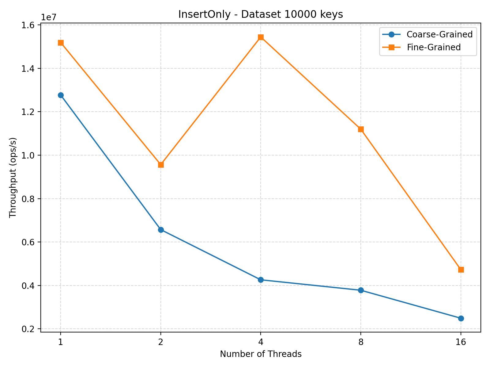
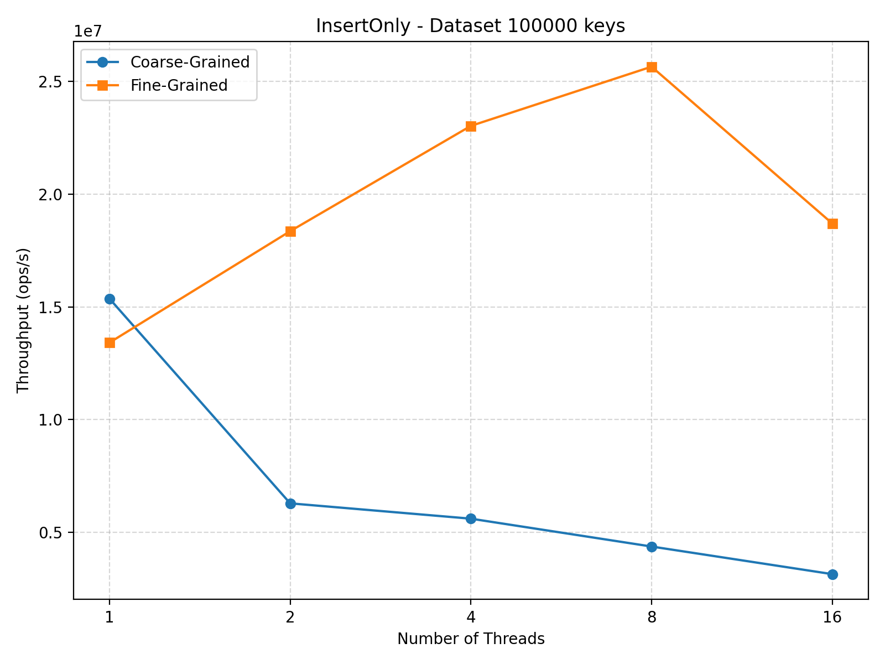
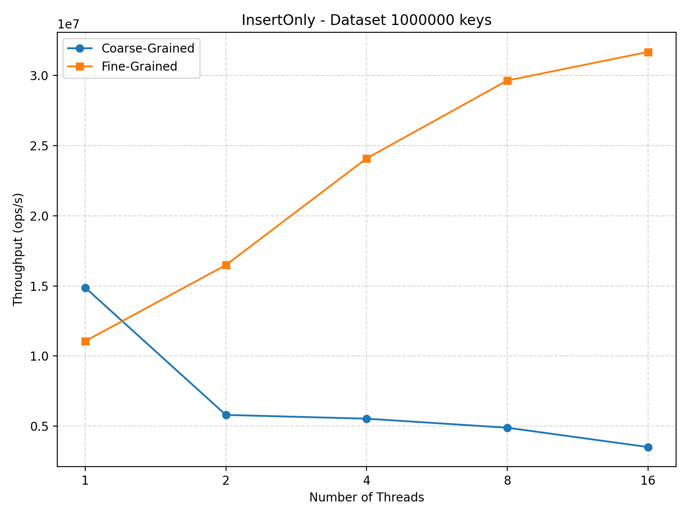
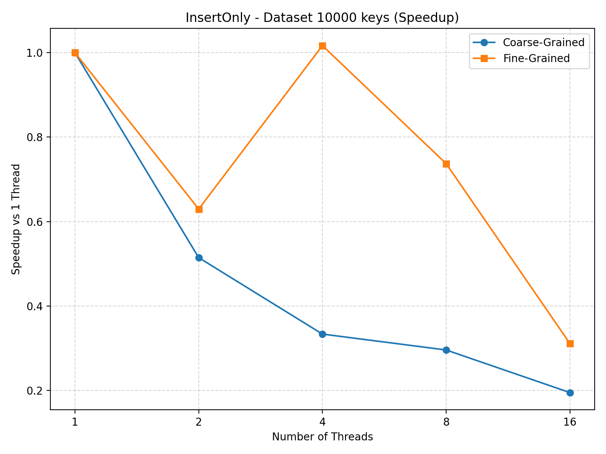
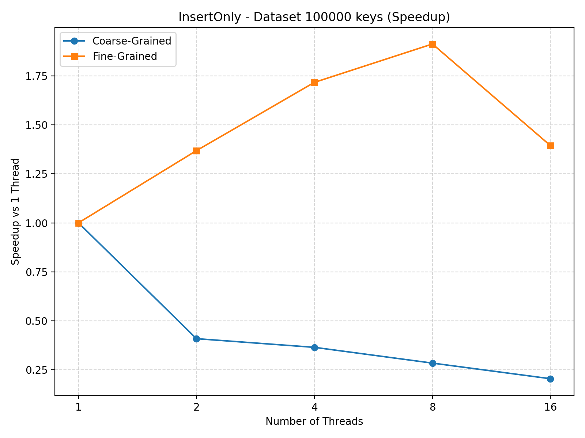
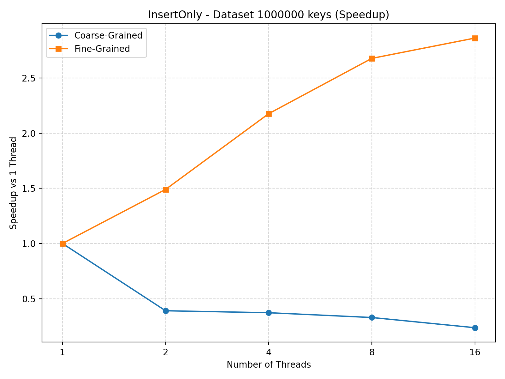
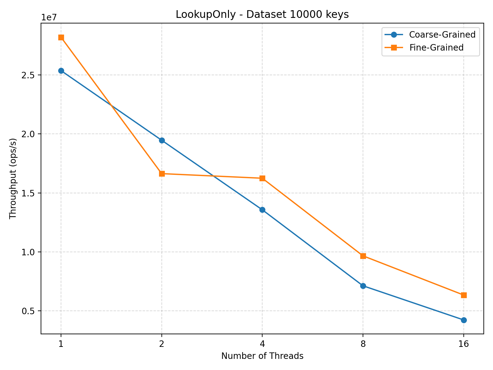
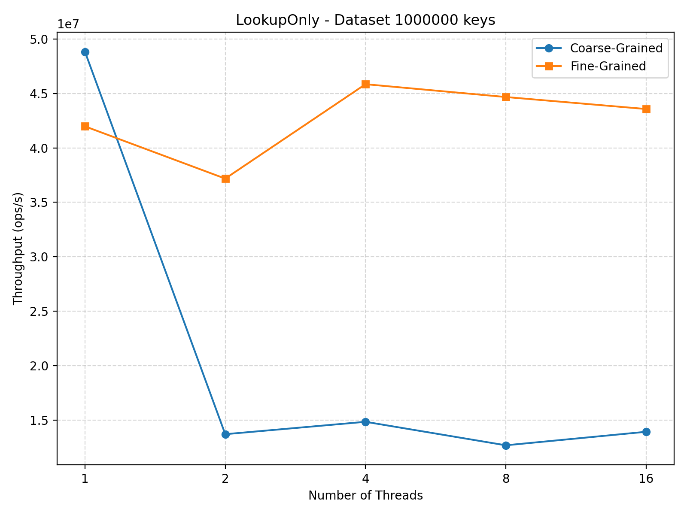
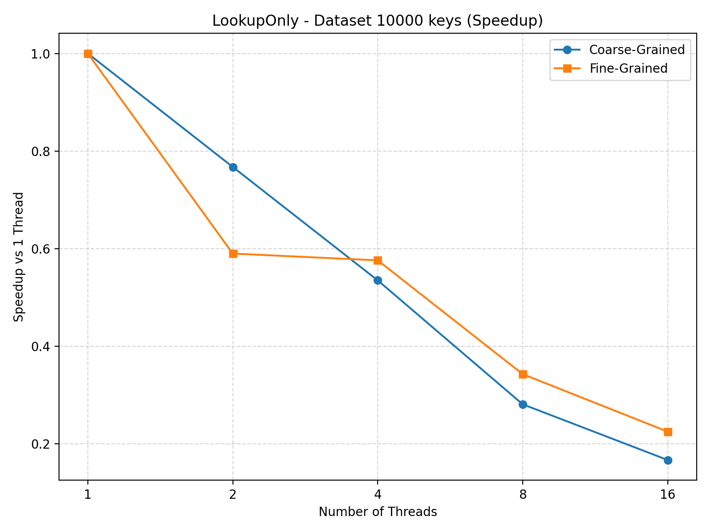
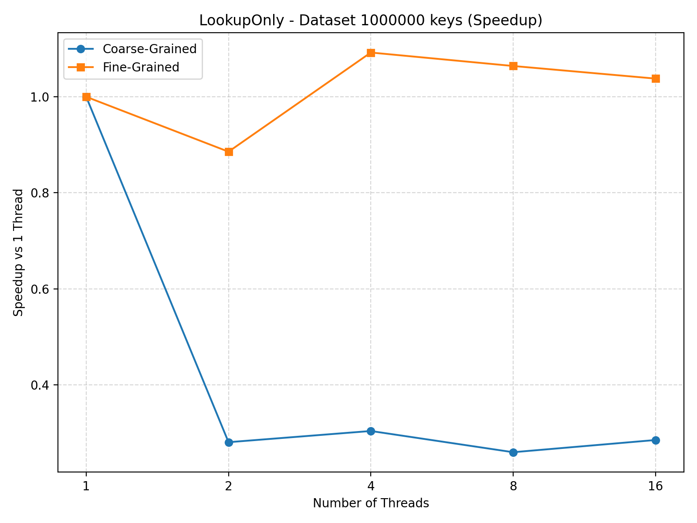

# Project A4: Concurrent Data Structures and Memory Coherence  
**Author:** Vito Salvaggio  

---

## Introduction
Concurrency is a defining feature of modern software systems, driven by the widespread availability of multicore processors. To exploit parallelism effectively, applications rely on shared in-memory data structures such as hash tables, trees, and queues that are accessed simultaneously by many threads. While hardware cache coherence protocols ensure correctness at the level of cache lines, they do not guarantee scalability. Instead, overall performance is heavily influenced by how synchronization is designed and how contention is managed at higher levels of abstraction.

At small thread counts, naïve synchronization strategies can appear efficient and simple. However, as concurrency increases, poor lock granularity can quickly become a bottleneck, serializing execution and negating the benefits of parallel hardware. Coarse-grained locking, where a single global mutex protects an entire data structure, is easy to reason about and ensures correctness, but often performs poorly under contention. In contrast, fine-grained locking attempts to increase parallelism by protecting smaller regions of shared state independently, at the cost of increased implementation complexity and potential cache coherence overhead.

This project explores these trade-offs by implementing a concurrent hash table using chaining and evaluating two synchronization strategies: a coarse-grained global lock and a fine-grained lock per bucket. The hash table serves as a representative shared data structure whose behavior is sensitive to both workload composition and thread count. By varying the number of threads, dataset sizes, and operation mixes (lookup-only, insert-only, and mixed workloads), the study highlights how synchronization granularity affects throughput, scalability, and interaction with the memory hierarchy.

Beyond raw throughput, this investigation emphasizes the role of cache coherence, false sharing, and contention in limiting scalability on multicore systems. Even when locks are independent, threads may still interfere through shared cache lines or frequent coherence traffic. The results are interpreted using principles from cache coherence protocols and Amdahl’s Law, illustrating how small serial sections or shared resources can dominate performance at scale. Overall, this project demonstrates that achieving high performance in concurrent data structures requires careful synchronization design that balances simplicity, correctness, and scalability on modern hardware.

**Learning Goals:**  
- Implement a thread-safe hash table and ensure correctness under concurrency.  
- Compare coarse vs. fine synchronization in terms of throughput and scalability.  
- Measure the effects of contention and false sharing on throughput.  
- Explain performance trends using cache coherence, contention, and Amdahl’s Law.  

**Tools Used:**  
- C++11 with `std::thread` and `std::mutex`.  
- CSV output for benchmark results.  
- Python/Matplotlib for plotting throughput and scaling.  

---

## Methodology

### Experimental Setup
- **CPU:** Intel multicore laptop (hyperthreaded).  
- **Compiler:** GCC 12.2.0 with `-O3 -march=native`.  
- **Benchmark Execution:**  
  - All threads pinned to cores to reduce scheduling noise.  
  - Benchmarks repeated multiple times to ensure reproducibility.  
  - CSV files generated with columns: `Dataset,Threads,Workload,CoarseTput,FineTput`.  

- **Hash Table Versions:**  
  1. **Coarse-Grained Lock:** Single global mutex guards all operations.  
  2. **Fine-Grained Lock:** One mutex per bucket, reducing lock contention.  

- **Workloads:**  
  1. Lookup-only (read-dominated)  
  2. Insert-only (write-dominated)  
  3. Mixed 70/30 (read/write)  

- **Dataset sizes:** 10⁴, 10⁵, 10⁶ keys  
- **Thread counts:** 1, 2, 4, 8, 16 threads  

---

## Results

### 1. Insert-Only Workload

**Throughput (ops/s)**  

| Dataset | Threads | CoarseTput | FineTput |
|---------|--------|------------|----------|
| 10⁴     | 1      | 1.28e7     | 1.52e7   |
| 10⁴     | 2      | 6.57e6     | 9.57e6   |
| 10⁴     | 4      | 4.26e6     | 1.54e7   |
| 10⁴     | 8      | 3.78e6     | 1.12e7   |
| 10⁴     | 16     | 2.49e6     | 4.73e6   |
| 10⁵     | 1      | 1.54e7     | 1.34e7   |
| 10⁵     | 2      | 6.28e6     | 1.84e7   |
| 10⁵     | 4      | 5.60e6     | 2.30e7   |
| 10⁵     | 8      | 4.36e6     | 2.57e7   |
| 10⁵     | 16     | 3.13e6     | 1.87e7   |
| 10⁶     | 1      | 1.49e7     | 1.11e7   |
| 10⁶     | 2      | 5.81e6     | 1.65e7   |
| 10⁶     | 4      | 5.54e6     | 2.41e7   |
| 10⁶     | 8      | 4.89e6     | 2.96e7   |
| 10⁶     | 16     | 3.52e6     | 3.17e7   |

**Figures for Insert-Only Workload:**  
- **Throughput vs Threads:**
   - 10k: 
  
   
  
  - 100k: 
  
     
  
  - 1M:
  
    
  
- **Speedup (relative to 1 thread):**  
  - 10k: 
  
   
  
  - 100k: 
  
     
  
  - 1M:
  
    
  

**Observation:**  
- The coarse-grained table suffers from contention as thread count increases.  
- Fine-grained table scales better due to per-bucket locking, achieving up to 9× higher throughput for 16 threads.  

---

### 2. Lookup-Only Workload

**Throughput (ops/s)**  

| Dataset | Threads | CoarseTput | FineTput |
|---------|--------|------------|----------|
| 10⁴     | 1      | 2.54e7     | 2.82e7   |
| 10⁴     | 2      | 1.95e7     | 1.66e7   |
| 10⁴     | 4      | 1.36e7     | 1.62e7   |
| 10⁴     | 8      | 7.13e6     | 9.67e6   |
| 10⁴     | 16     | 4.23e6     | 6.34e6   |
| 10⁵     | 1      | 4.60e7     | 4.27e7   |
| 10⁵     | 2      | 1.40e7     | 3.72e7   |
| 10⁵     | 4      | 1.61e7     | 4.08e7   |
| 10⁵     | 8      | 1.29e7     | 3.70e7   |
| 10⁵     | 16     | 1.33e7     | 3.01e7   |
| 10⁶     | 1      | 4.88e7     | 4.20e7   |
| 10⁶     | 2      | 1.37e7     | 3.72e7   |
| 10⁶     | 4      | 1.49e7     | 4.58e7   |
| 10⁶     | 8      | 1.27e7     | 4.47e7   |
| 10⁶     | 16     | 1.39e7     | 4.36e7   |

**Figures for Lookup-Only Workload:**  
- **Throughput vs Threads:**
   - 10k: 
  
   
  
  - 100k: 
  
     
  
  - 1M:
  
    
  
- **Speedup (relative to 1 thread):**  
  - 10k: 
  
   
  
  - 100k: 
  
     
  
  - 1M:
  
    

**Observation:**  
- Coarse-grained locking limits scalability even for read-heavy workloads.  
- Fine-grained locking provides near-linear speedup up to 8 threads, then plateaus due to cache-line contention.  

---

## Analysis & Insight

1. **Lock Granularity:**  
   - Coarse-grained locking provides a straightforward correctness model by serializing all operations through a single mutex. While this approach minimizes implementation complexity and avoids subtle concurrency bugs, it fundamentally limits scalability. As thread count increases, contention for the global lock dominates execution time, causing throughput to degrade rapidly even when the underlying hash table operations are short. This effect is especially pronounced in write-heavy workloads, where inserts must exclusively acquire the lock and block all other threads.  

   - Fine-grained per-bucket locking significantly reduces this contention by allowing threads to operate on different buckets concurrently. In workloads where keys are well-distributed across buckets, this design enables multiple inserts or lookups to proceed in parallel, increasing effective utilization of available cores. The results demonstrate that finer granularity shifts contention from a single global bottleneck to localized hot buckets, which is far more scalable in practice.

2. **Scalability Trends:**  
   - Insert-only workloads show the clearest benefit from fine-grained locking. As thread count increases, the coarse-grained implementation exhibits diminishing throughput due to lock serialization, whereas the fine-grained design achieves substantial speedup, particularly for larger datasets where keys are spread across more buckets. This behavior highlights how reducing the critical section size directly improves scalability.

   - Lookup-only workloads also benefit from fine-grained locking, though to a lesser extent. While lookups are read-dominated and typically faster than inserts, they still require synchronization to ensure consistency. As thread count grows, both implementations eventually plateau, indicating that factors beyond lock contention, such as cache coherence traffic, begin to dominate performance.

3. **Cache Coherence and False Sharing:**  
   - The observed plateaus in speedup for fine-grained locking suggest the presence of cache-line contention and coherence overhead. Even when locks are independent, multiple mutexes and bucket metadata may reside on the same cache lines, causing false sharing between threads. This leads to frequent cache invalidations and reduced efficiency as core counts increase.

   - Dataset size also plays a role: smaller datasets are more likely to fit within lower-level caches, increasing the likelihood of contention on shared cache lines. Larger datasets distribute memory accesses more widely, delaying cache saturation and improving scaling behavior. These effects demonstrate that memory layout and cache-line alignment are as important as lock granularity in high-performance concurrent data structures.

4. **Amdahl’s Law (S(N) = 1 / [ (1 − P) + (P / N) ]):**  
   - Amdahl’s Law provides a useful framework for interpreting the results. In the coarse-grained design, the global lock represents a large serial fraction that fundamentally limits achievable speedup, regardless of how many threads are added. In contrast, fine-grained locking reduces the serial portion by allowing more operations to execute concurrently, resulting in significantly higher parallel efficiency.

   - However, the eventual flattening of speedup curves shows that even fine-grained designs are subject to diminishing returns. The remaining serial components, such as memory allocation, shared metadata updates, and cache coherence overhead, place an upper bound on performance. This reinforces the idea that eliminating a single bottleneck often exposes new ones at higher levels of concurrency. 

---

## Conclusion
- This project demonstrates the critical impact of synchronization design on the performance and scalability of concurrent data structures. While coarse-grained locking offers simplicity and correctness, it fails to scale beyond a small number of threads due to excessive contention and serialization. As a result, it is best suited for single-threaded or lightly threaded scenarios where concurrency is limited.

- Fine-grained per-bucket locking substantially improves scalability, particularly for write-intensive workloads. By allowing independent operations to proceed in parallel, it enables much higher throughput and better utilization of multicore hardware. However, these gains are not unlimited: cache coherence traffic, false sharing, and memory hierarchy effects eventually constrain performance as thread counts increase.

- Overall, the results highlight that achieving high performance in concurrent systems requires more than just adding locks, it requires careful consideration of lock granularity, memory layout, and hardware-level interactions. Even relatively simple data structures like hash tables can exhibit complex scaling behavior when shared across many threads. These findings underscore the importance of designing synchronization strategies that balance correctness, complexity, and scalability on modern multicore architectures.  

---

### Future Work
- Explore lock-free hash tables or optimistic concurrency to further reduce contention.  
- Measure latency distributions (p50/p95/p99) alongside throughput.  
- Extend to tree structures (BST, B+-Tree) for comparison under concurrency.  
- Investigate NUMA-aware bucket placement to improve memory locality.  
